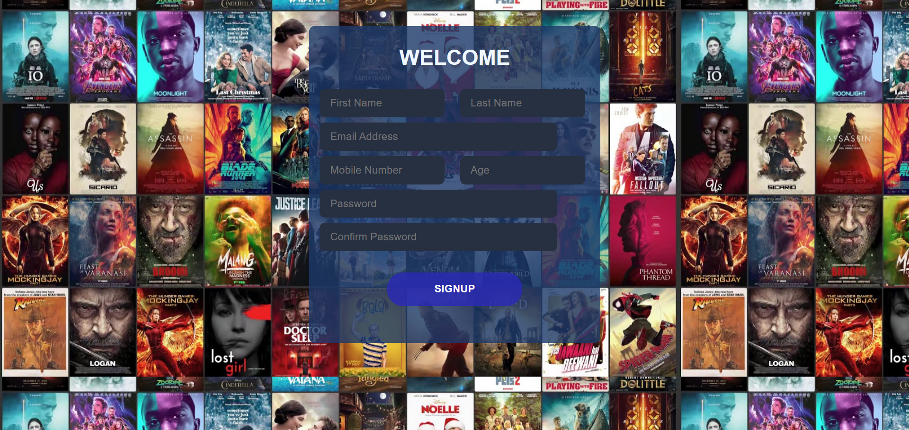

# Movie App 🎬

Welcome to the Movie App! This web application is designed to provide you with all the information you need about movies. Whether you're looking for details about a specific film or just exploring your movie options, this app has got you covered.

## Features ⭐
 
✨ **Comprehensive Movie Information**: Get access to a vast collection of movie data, including details about the cast, release year, IMDb rating, and genre.

✨ **Easy-to-Use Interface**: The application is built with a user-friendly design, making it effortless to navigate and search for movies.

✨ **Powered by OMDB API**: Utilizing the powerful OMDB (The Movie Database) API, this app provides accurate and up-to-date information about movies.

✨ **Customizable and Extendable**: The application is developed using JavaScript, HTML, and CSS, allowing for easy customization and extension of its functionalities.

✨ **Sorting Options**: Sort movies based on their ratings to discover the highest-rated films in an instant.
 
✨ **Responsive Design**: Enjoy a seamless experience across different devices, as the app is fully responsive and optimized for mobile, tablet, and desktop screens.

✨ **Detailed Movie Pages**: Clicking on a movie title takes you to a dedicated movie detail page. Here, you can find the movie's poster, title, genres, an overview/summary, and the names of the top five cast members.

✨ **Interactive Search Results**: The search results are presented in an itemized clickable list, accompanied by captivating movie posters. Simply click on a movie title to explore its details.

✨ **Valid HTML & CSS**: The codebase adheres to web standards, ensuring a reliable and consistent browsing experience.

  <a href="https://glittery-crostata-94ff7d.netlify.app/" target="_blank">**Visit Now** 🎥</a>

<h2> Snippets</h2>

 
<h2> Signup Page </h2>

 
   

 
 ## Tools Used 🛠️
      

 

<a href="https://glittery-crostata-94ff7d.netlify.app/" target="_blank">**Visit Now** 🚀</a>

## 📬 Contact

If you want to contact me, you can reach me through below handles.

 

  &emsp;
  &emsp;
  &emsp;	
 

 

  <strong>💓Happy Coding😄💻</strong>

